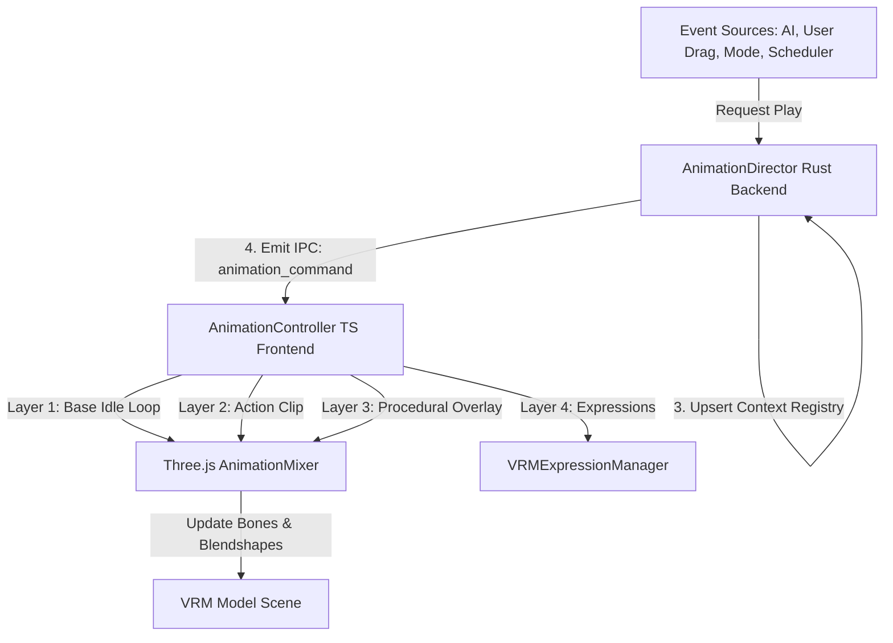

# Kế hoạch Triển khai: Hệ thống Animation Runtime cho Nhân vật (Chiro-Pet)

Kế hoạch này chi tiết hóa các bước thiết kế và triển khai hệ thống quản lý và xử lý Animation cho nhân vật ảo VRM trong ứng dụng Chiro-Pet. Luồng xử lý tuân thủ chặt chẽ các đặc tả kỹ thuật và nguyên tắc thiết kế được định nghĩa trong [Animation_compose_guide.md](file:///home/tvphuong1/Documents/Repository/chiro-pet/docs/Animation_compose_guide.md) và [Desktop_companion_app_technical_specification.md](file:///home/tvphuong1/Documents/Repository/chiro-pet/docs/Desktop_companion_app_technical_specification.md).

---

## 1. Phân tích hiện trạng & Giải pháp kiến trúc

Hiện tại, mã nguồn ứng dụng đang có:
*   **Backend (Rust + Tauri)**: Đã có chức năng tracking phím ALT và toggle click-through cơ bản trong `src-tauri/src/input_tracking.rs`. Chưa có module quản lý hành vi và animation (`Behavior Orchestrator`).
*   **Frontend (React + Three.js)**: Đã có `useVRMScene.ts` thực hiện load model VRM `Cartethyia.vrm` và chạy animation tuần hoàn breathing (thở) cùng blinking (nháy mắt) dạng procedural đơn giản. Chưa có hệ thống `AnimationController` để load và blend các action clips `.vrma` nhận từ backend.
*   **Tài nguyên (Assets)**: Thư mục `public/animation/bvh/` đang chứa 118 file `.bvh` mô tả nhiều chuyển động khác nhau, nhưng chưa có các file `.vrma` chuẩn hóa và chưa có file khai báo cấu trúc `manifest.json`.

> [!IMPORTANT]
> **Nguyên tắc bất biến**: Backend (Rust) luôn là **Source of Truth** quyết định trạng thái logic của animation. Frontend (TypeScript/Three.js) chỉ thực thi các chỉ thị (`AnimationCommand`) nhận được qua kênh IPC của Tauri, đảm bảo tính đồng bộ hoàn hảo với các sự kiện hệ thống (User Drag, AI Chat, Desktop Context change).

---

## 2. Thiết kế chi tiết & Đề xuất Thay đổi

Đề xuất triển khai hệ thống Animation Runtime theo cấu trúc modular hóa cực kỳ cao, đảm bảo tính mở rộng dễ dàng và tuân thủ các quy tắc lập trình (Immutability, Error Handling, Input Validation, Unit Testing).

---

## 3. Danh sách các File thay đổi cụ thể

### Component A: Rust Backend Core (`src-tauri/src/core/behavior/`)

Bộ não điều phối hành vi nhân vật được thiết kế thành một module độc lập trong Backend.

#### [NEW] [animation_state.rs](file:///home/tvphuong1/Documents/Repository/chiro-pet/src-tauri/src/core/behavior/animation_state.rs)
*   Định nghĩa enum `AnimationState` chứa đầy đủ các trạng thái logic: `Idle`, `Listening`, `Thinking`, `Talking`, `Happy`, `Shy`, `Sad`, `Annoyed`, `Surprised`, `Proud`, `Sleepy`, `Focus`, `Gaming`, `Meeting`, `Private`, `Dragging`, `MenuOpen`, `Petted`, `OneShotAction`.
*   Cung cấp các trait serde (`Serialize`, `Deserialize`) để gửi qua IPC.

#### [NEW] [animation_command.rs](file:///home/tvphuong1/Documents/Repository/chiro-pet/src-tauri/src/core/behavior/animation_command.rs)
*   Định nghĩa struct `AnimationCommand` đóng vai trò là IPC contract chính gửi xuống Frontend.
*   Bao gồm các thông số điều khiển: `command_id` (UUID), `source`, `timestamp_ms`, `state`, `animation_id`, `expression`, `loop_anim`, `play_once`, `crossfade_ms`, `duration_ms`, `priority`, `context_id`, `interrupt_policy`, `fallback`, `section`.
*   Cung cấp các hàm tạo helper nhanh: `idle()`, `thinking(context_id)`, `talking(duration_ms, context_id)`, `dragging()`.

#### [NEW] [animation_manifest.rs](file:///home/tvphuong1/Documents/Repository/chiro-pet/src-tauri/src/core/behavior/animation_manifest.rs)
*   Định nghĩa struct `AnimationManifest` chịu trách nhiệm đọc và parse cấu trúc file `manifest.json` từ disk/Tauri resources.
*   Quản lý map danh sách các clips, giải quyết logic mapping từ một logical `AnimationState` sang một `animation_id` thực tế dựa trên tags và cơ chế anti-repeat (tránh lặp đi lặp lại cùng một clip idle).

#### [NEW] [context_registry.rs](file:///home/tvphuong1/Documents/Repository/chiro-pet/src-tauri/src/core/behavior/context_registry.rs)
*   Định nghĩa `ContextRegistry` giúp quản lý các ngữ cảnh animation đồng thời (Ví dụ: Đang ở trạng thái `Focus` (priority 40), AI gửi câu thoại `Talking` (priority 60), khi thoại xong sẽ khôi phục lại trạng thái `Focus`).
*   Hỗ trợ tìm kiếm context có độ ưu tiên cao nhất (`highest_priority`).

#### [NEW] [animation_director.rs](file:///home/tvphuong1/Documents/Repository/chiro-pet/src-tauri/src/core/behavior/animation_director.rs)
*   Bộ core orchestrator của backend. Cung cấp API async:
    *   `play(app, command)`: Tiếp nhận chỉ thị animation mới, áp dụng kiểm tra chính sách ngắt (`can_interrupt`), cập nhật `ContextRegistry`, kích hoạt timer fallback tự động chuyển đổi khi hết `duration_ms` và phát emit sự kiện IPC `animation_command`.
    *   `stop_context(app, context_id)`: Kết thúc một ngữ cảnh (ví dụ: thả drag chuột, AI nói xong), tìm kiếm animation kế tiếp để khôi phục hoặc quay về `idle`.
    *   `force_idle(app)`: Dọn dẹp toàn bộ registry, đưa nhân vật về tư thế mặc định an toàn.

#### [NEW] [mod.rs](file:///home/tvphuong1/Documents/Repository/chiro-pet/src-tauri/src/core/behavior/mod.rs)
*   Export toàn bộ các cấu trúc dữ liệu trên để cung cấp ra ngoài lib.

---

### Component B: Rust Backend Tauri Integration (`src-tauri/src/`)

Đăng ký và tích hợp `AnimationDirector` vào vòng đời ứng dụng Tauri.

#### [MODIFY] [commands.rs](file:///home/tvphuong1/Documents/Repository/chiro-pet/src-tauri/src/commands.rs)
*   Thêm các hàm command được export sang frontend:
    *   `anim_play(cmd, state)`: Yêu cầu thủ công một animation (cho debug, radial menu).
    *   `anim_stop_context(context_id, state)`: Báo kết thúc một context.
    *   `anim_force_idle(state)`: Khôi phục tức thì về idle.
    *   `anim_list_available(state)`: Trả về danh sách animation có sẵn.

#### [MODIFY] [lib.rs](file:///home/tvphuong1/Documents/Repository/chiro-pet/src-tauri/src/lib.rs)
*   Khai báo module `core::behavior`.
*   Khởi tạo `AnimationDirector` bằng cách load manifest và đưa vào State quản lý của Tauri thông qua `.manage()`.
*   Đăng ký các Tauri command mới vào `.invoke_handler`.

---

### Component C: Frontend TypeScript Layers & Three.js Integrations (`src/`)

Hiện thực hóa bộ xử lý 4-layer blending ở Client.

#### [NEW] [src/types/animation.ts](file:///home/tvphuong1/Documents/Repository/chiro-pet/src/types/animation.ts)
*   Khai báo interface đồng bộ tuyệt đối với Backend: `AnimationCommand`, `AnimationState`, `AnimationManifest`, `AnimationManifestEntry`, `SectionedPlayback`.

#### [NEW] [src/services/animation.ts](file:///home/tvphuong1/Documents/Repository/chiro-pet/src/services/animation.ts)
*   Triển khai helper lắng nghe sự kiện IPC Tauri (`listen`) đối với `animation_command` và phát sự kiện phản hồi ngược về Rust backend.

#### [NEW] [src/overlay/three/VRMAClipLoader.ts](file:///home/tvphuong1/Documents/Repository/chiro-pet/src/overlay/three/VRMAClipLoader.ts)
*   Sử dụng thư viện `@pixiv/three-vrm-animation` để load file chuyển động `.vrma` và convert nó thành `THREE.AnimationClip` chuẩn hóa tương thích với humanoid bones của Three.js.
*   *Lưu ý dự phòng*: Do thư mục `public/animation/bvh/` đang có sẵn các file `.bvh` mà chưa có `.vrma`, module này sẽ đi kèm một lớp Adapter chuyển đổi hoặc cơ chế Mock/Fallback để đảm bảo ứng dụng chạy không bị lỗi thiếu file chuyển động.

#### [NEW] [src/overlay/three/SectionedPlayback.ts](file:///home/tvphuong1/Documents/Repository/chiro-pet/src/overlay/three/SectionedPlayback.ts)
*   Lớp quản lý các clips có độ dài linh hoạt (như `thinking`, `talking`).
*   Tính toán deltaTime ở frame loop, điều khiển chạy phần `intro`, tự động lặp lại phần `loop` liên tục và chỉ nhảy sang phần `outro` để kết thúc êm ái khi nhận lệnh `requestExit()` hoặc hết thời gian.

#### [NEW] [src/overlay/three/AnimationController.ts](file:///home/tvphuong1/Documents/Repository/chiro-pet/src/overlay/three/AnimationController.ts)
*   Triển khai `THREE.AnimationMixer` cho mô hình VRM.
*   Thực hiện cơ chế **4-Layer Blend** song song:
    1.  **Layer 1 (Base, weight 1.0)**: Chạy loop idle thông thường.
    2.  **Layer 2 (Action, weight 0.0 -> 1.0)**: Chạy clip đè lên, tự động crossfade (lerp) êm ái trong khoảng thời gian xác định (`crossfade_ms`).
    3.  **Layer 3 (Procedural Overlay, low weight)**: Tự động cộng dồn chuyển động breathing (thở), sway (lắc đầu nhẹ).
    4.  **Layer 4 (Expression)**: Đồng bộ blendshape biểu cảm khuôn mặt qua `VRMExpressionManager` tương ứng với cảm xúc truyền vào.
*   Quản lý giảm cường độ (scaling intensity) của Layer 3 khi Layer 2 đang hoạt động mạnh để tránh hiện tượng rung lắc mô hình.

#### [MODIFY] [src/hooks/useVRMScene.ts](file:///home/tvphuong1/Documents/Repository/chiro-pet/src/hooks/useVRMScene.ts)
*   Tích hợp `AnimationController` vào trong hook quản lý Canvas.
*   Khi model load thành công, khởi tạo controller và kích hoạt cập nhật (`controller.update(deltaTime)`) ngay bên trong hàm render loop chính `animate()`.
*   Lắng nghe thay đổi trạng thái kéo thả (`isDragging`) để tự động kích hoạt animation `dragging` với độ ưu tiên cao nhất, khôi phục lại khi thả chuột.

---

### Component D: Configuration and Assets (`public/`)

#### [NEW] [public/animation/manifest.json](file:///home/tvphuong1/Documents/Repository/chiro-pet/public/animation/manifest.json)
*   Định nghĩa tệp cấu hình khai báo các clips chuyển động, độ ưu tiên mặc định (`priority`), thuộc tính loop/one_shot, thời gian crossfade tối ưu và timeline của các section (intro, loop, outro) cho từng clip.

---

## 4. User Review Required (Cần ý kiến người dùng)

> [!IMPORTANT]
> **Vấn đề định dạng file Animation (BVH vs VRMA)**:
> 1. Hiện tại thư mục `public/animation/bvh/` đang có sẵn rất nhiều chuyển động chất lượng dạng `.bvh`. Tuy nhiên, định dạng runtime chuẩn của ba thư viện Pixiv là `.vrma` (VRM Animation). Việc đọc trực tiếp `.bvh` tại thời điểm chạy (runtime) trong WebGL đòi hỏi retargeting xương bằng code phức tạp và tốn CPU.
> 2. **Đề xuất của chúng tôi**: Trong bước triển khai này, chúng tôi sẽ lập trình hệ thống hỗ trợ định dạng `.vrma` làm chuẩn cao cấp nhất (theo sát *Animation Compose Guide*).
> 3. Để kiểm thử ngay lập tức mà không bị lỗi thiếu file, chúng tôi sẽ:
>     * Tạo các dữ liệu Mock / Procedural trong `VRMAClipLoader` hoặc load tạm một vài clip chuyển động mẫu.
>     * Anh/chị có dự kiến convert bộ `.bvh` này sang `.vrma` bằng Blender offline trước, hay mong muốn chúng tôi tích hợp trực tiếp một trình đọc/convert `.bvh` thô trực tiếp ở Frontend? (Khuyên dùng phương án convert offline để tối ưu 100% hiệu năng GPU/CPU của overlay app).

> [!WARNING]
> **Đồng bộ hóa thư viện Frontend**:
> Để xử lý file `.vrma` mượt mà nhất, chúng ta cần cài đặt thêm thư viện `@pixiv/three-vrm-animation`. Việc này sẽ chỉnh sửa `package.json` và yêu cầu chạy lệnh cài đặt package (`pnpm install`). Bạn có đồng ý thực hiện bước cài đặt này tự động trong quá trình coding?

---

## 5. Verification Plan (Kế hoạch Kiểm thử & Xác minh)

### 5.1. Automated Tests (Kiểm thử Tự động)
1.  **Rust Backend Unit Tests**:
    *   Viết test case xác minh logic so sánh độ ưu tiên (`can_interrupt`) của `AnimationDirector` để đảm bảo lệnh kéo thả (priority 95) luôn ngắt được AI Talking (priority 60).
    *   Test logic giải quyết trạng thái fallback khi một context kết thúc.
2.  **Frontend Unit Tests**:
    *   Viết test case cho `SectionedPlayback` kiểm tra xem các giai đoạn intro -> loop -> outro có chuyển đổi chính xác theo lượng deltaTime truyền vào hay không.

### 5.2. Manual Verification (Kiểm thử Thủ công)
1.  **Khởi chạy ban đầu**: Kiểm tra mô hình Cartethyia tải thành công, có nháy mắt tự động (blinking) và thở nhẹ (breathing) ở Layer 3.
2.  **Kéo thả (Drag Mode)**: Nhấn giữ phím ALT để vào chế độ kéo thả. Mô hình phải lập tức chuyển sang tư thế `dragging` (co chân tay nhẹ tự nhiên). Khi thả chuột ra, mô hình chuyển đổi mềm mại (crossfade) trở về tư thế đứng đứng yên `idle`.
3.  **Radial Menu**: Click chuột phải, radial menu mở ra. Nhân vật tự động hướng mắt nhìn về menu/cursor (look-at procedural active), khuôn mặt mỉm cười nhẹ.
4.  **IPC Simulation**: Sử dụng Tauri console hoặc công cụ debug để kích hoạt lệnh thoại `anim_play(Talking)`. Kiểm tra xem khuôn mặt có áp blendshape khẩu hình miệng và chuyển động tay nhẹ không, sau khi hết thời gian ước lượng (duration) phải tự động quay về idle.
